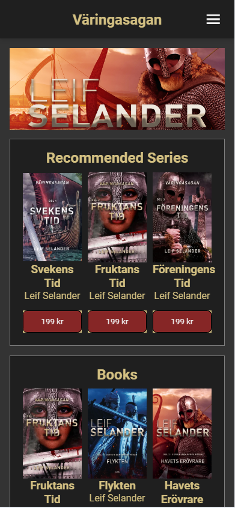
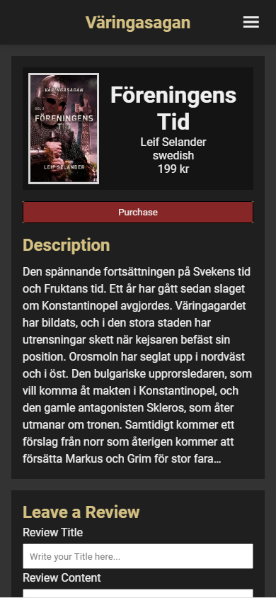
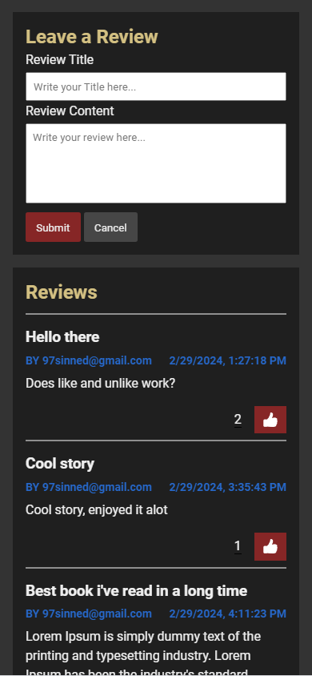

# Varingasagan

Working on a forum / book page for my dad Leif Selander.
I haven't really thought about the design yet so it's not very pretty but i'll post progress pictures below of hows it's going and how it looks like.

# Progress List
- #1 Setting up a project with React router. ✅
- #2 Setting up Firebase. ✅
- #3 Creating an account with alot of inputs (name, password, email, age, language etc..) ✅
- #4 Signing in with email and password (matching with the database) or with google. ✅
- #5 Be able to sign in as an admin (admin will have access to other things. Like deleting comments etc..) ✅
- #6 Make a header where you can navigate to different places on the page and check if the user is logged in or admin. ✅
- #7 Homepage, where I fetch data / books from the database and show on the screen (don't know how I wanna show it yet). ✅
- #8 See more information about specific books when you press on it / it takes to you another page. (useParams) ✅
- #9 Be able to review a book (Title, content and score). ✅
- #10 Fetch and show all reviews for a specific book. ✅
- #11 Like and unlike reviews. ✅
- #12 Change the Font and the look of the page (colors) maybe layout.
- #13 Filter and search for data / books.
- #14 Make all sections work, like: audiobooks, books, etc..
- #15 Add the total amount of reviews under a book next to the "Reviews" title under each book.
- #16 Admin page where you can create new data that you want to show on the page.

# Progress Pictures
## Home page

## Book information

