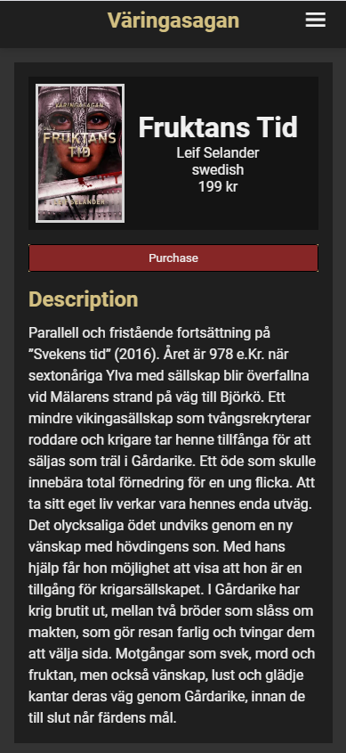
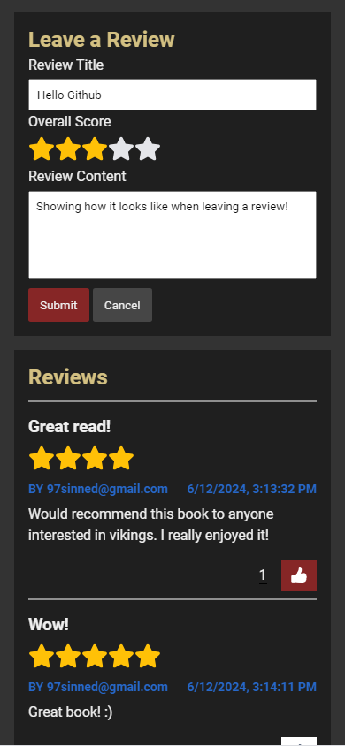
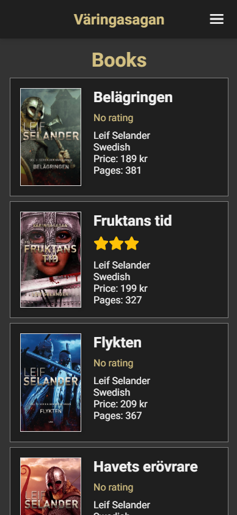

# Varingasagan

Working on a forum / book page for my dad Leif Selander.
I haven't really thought about the design yet so it's not very pretty but i'll post progress pictures below of hows it's going and how it looks like.

# Progress List
- #1 Setting up a project with React router. ✅
- #2 Setting up Firebase. ✅
- #3 Creating an account with alot of inputs (name, password, email, age, language etc..) ✅
- #4 Signing in with email and password (matching with the database) or with google. ✅
- #5 Be able to sign in as an admin (admin will have access to other things. Like deleting comments etc..) ✅
- #6 Make a header where you can navigate to different places on the page and check if the user is logged in or admin. ✅
- #7 Homepage, where I fetch data / books from the database and show on the screen (don't know how I wanna show it yet). ✅
- #8 See more information about specific books when you press on it / it takes to you another page. (useParams) ✅
- #9 Be able to review a book (Title, content and score). ✅
- #10 Fetch and show all reviews for a specific book. ✅
- #11 Like and unlike reviews. ✅
- #12 Change the Font and the look of the page (colors) maybe layout. ✅
- #13 Create a section for all books and all audiobooks where the design is different compared to the home page. ✅
- #14 Calculate and show the average rating of books ✅
- #15 Create admin account and check if the logged in user in an admin. ✅
- #16 Create functions that only admins can access like delete comments.
- #16 Create an admin page where admins can add new books/audiobooks and delete books/audiobooks.
- #17 Filter and search for data / books.
- #18 Add more icons.

# Progress Pictures
## Home page

## Book information page

## Books page
