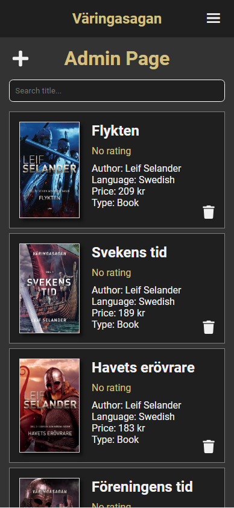

# Varingasagan

Working on a forum / book page for my dad Leif Selander.
I haven't really thought about the design yet so it's not very pretty but i'll post progress pictures below of hows it's going and how it looks like.

Programming stack with this project:
React,
Firebase,
Node.JS,
CSS
MUI

# Progress List
- #1 Setting up a project with React router. ✅
- #2 Setting up Firebase. ✅
- #3 Creating an account with alot of inputs (name, password, email, age, language etc..) ✅
- #4 Signing in with email and password (matching with the database) or with google. ✅
- #5 Be able to sign in as an admin (admin will have access to other things. Like deleting comments etc..) ✅
- #6 Make a header where you can navigate to different places on the page and check if the user is logged in or admin. ✅
- #7 Homepage, where I fetch data / books from the database and show on the screen (don't know how I wanna show it yet). ✅
- #8 See more information about specific books when you press on it / it takes to you another page. (useParams) ✅
- #9 Be able to review a book (Title, content and score). ✅
- #10 Fetch and show all reviews for a specific book. ✅
- #11 Like and unlike reviews. ✅
- #12 Change the Font and the look of the page (colors) maybe layout. ✅
- #13 Create a section for all books and all audiobooks where the design is different compared to the home page. ✅
- #14 Calculate and show the average rating of books ✅
- #15 Create admin account and check if the logged in user in an admin. ✅
- #16 Create functions that only admins can access like delete comments. ✅
- #17 Filter and search for data / books. ✅
- #18 Create a search page (after pressing enter while searching you get taken to another page, Use query parameters). ✅
- #19 Create a admin page where admins can add new books. ✅
- #20 On the admin page they should be able to delete books. ✅
- #21 Fix it so admins can edit information about the books. ✅
- #22 Create an about page and write about Leif Selander . ✅
- #23 Add icons. ✅
- #24 When showing books, create ternaries to check if the data exists or not, if it doesnt show nothing. ✅
- #25 Update the login page so it looks better. ✅
- #26 Create media querys for desktop view. ✅
- #27 Update / work on the design of the home page (doesn't look good enough). ✅
- #28 Add a red thumb icon when you haven't liked a review.

- #?? Cleanup code (make more components, delete logs etc...).

# Progress Pictures

# Phone View
## Home page
### 1

### 2

### 3

## Book information page

## Books page

## Admin Page

# Desktop View